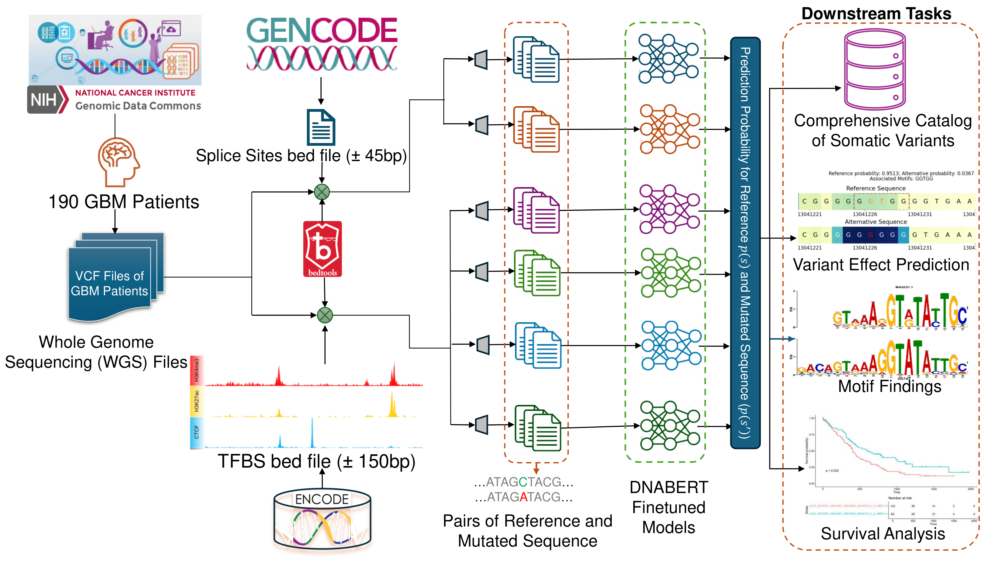

# DeepVRegulome


DeepVRegulome is an end‑to‑end framework for predicting the functional impact of small somatic variants in non‑coding regulatory regions (splice sites and transcription‑factor‑binding sites) using fine‑tuned DNABERT models.

---

## ✨ Key Features

- ✅ DNABERT-based classifiers for:
  - Splice sites (acceptor, donor)
  - ~700 TFBS models
- ✅ Region-aware scoring of somatic variants using Δp and log₂ odds
- ✅ Batch processing with multiprocessing and BED/VCF support
- ✅ Interactive Streamlit dashboard with:
  - Variant tables, plots, and survival analysis
  - Attention score visualizations

---

📁 Repository Structure
```
DeepVRegulome/
├── .devcontainer/
├── .streamlit/
├── data/
│   └── Brain/
├── figures/                         # Exported visualizations (e.g. attention maps)
│   └── attention/
│       ├── CTCFL/
│       └── ZNF384/
├── notebooks/                      # Jupyter notebooks for key pipeline steps
│   ├── 01_parse_and_merge_vcfs.ipynb            # Merge and parse VCFs
│   ├── 02_tfbs_intersection.ipynb               # Intersect VCF with TFBS BEDs
│   ├── 03_dnabert_input_generation.ipynb        # Generate sequences for DNABERT
│   ├── 04_scoring_candidate_variants.ipynb      # Compute Δp / logOR & rank variants
│   └── 05_tfbs_attention_motif_visualization.ipynb  # Plot attention scores & motifs
├── scripts/                       # Shell scripts for batch inference
│   ├── run_prediction_tfbs.sh                 # Predict with TFBS models
│   └── run_prediction_splice_acceptor.sh      # Predict with acceptor models
├── src/
│   └── deepvregulome/             # Core Python modules
│       ├── __init__.py
│       ├── dnabert_data_generation.py         # Wild/mutated seq generation
│       ├── intersect.py                       # BED/VCF overlap engine
│       ├── vcf_loader.py                      # VCF parsing utilities
│       └── config.yaml                        # Centralized path config
├── streamlit_app/
│   └── app_variant_clinical_dashboard.py      # Live clinical dashboard
├── LICENSE
├── README.md
├── requirements.txt
└── .gitignore

```
## 🧪 Installation
```bash
git clone https://github.com/DavuluriLab//DeepVRegulome.git
cd DeepVRegulome
python3 -m venv venv && source venv/bin/activate
pip install -r requirements.txt
```


## ⚙️ Typical Pipeline Flow
| Step | Description | Location |
|------|-------------|----------|
| 1️⃣ | Parse + merge somatic VCFs | `01_parse_and_merge_vcfs.ipynb` |
| 2️⃣ | Intersect variants with TFBS BEDs | `02_tfbs_intersection.ipynb` |
| 3️⃣ | Generate ref/mutated k-mers for DNABERT | `03_dnabert_input_generation.ipynb` |
| 4️⃣ | Predict with DNABERT models | `scripts/run_prediction_tfbs.sh` |
| 5️⃣ | Compute Δp, find candidate variants | `04_scoring_candidate_variants.ipynb` |
| 6️⃣ | Visualize attention scores and motifs | `05_tfbs_attention_motif_visualization.ipynb` |
| 7️⃣ | Browse results interactively | `streamlit_app/app_variant_clinical_dashboard.py` |


## 📊 Example Outputs
  * Candidate variant count by TFBS
  * DNABERT attention heatmaps
  * High-impact motif shifts due to mutations
  * Kaplan–Meier plots for clinical stratification

See figures/attention/ for examples like CTCFL.


## 🌐 Live Demo

An interactive instance of the DeepVRegulome dashboard is hosted here:
➡️ **[https://davuluri-lab-brainved.streamlit.app/]([https://deepvregulome.streamlit.app/](https://deepvregulome.streamlit.app/))**
The deployed app lets you browse model performance metrics and variant-effect predictions without installing any software locally.

## 🧬 Model Checkpoints
Full DNABERT fine-tuned weights (acceptor, donor, and 700 TFBS models) will be deposited in Zenodo and made publicly available immediately upon journal acceptance.
In the meantime, researchers may request access by emailing pratik.dutta@stonybrook.edu and ramana.davuluri@stonybrookmedicine.edu  with a brief statement of intended use.

## Citation
If you use DeepVRegulome in your research, please cite:


## 🧬 Model Checkpoints
MIT. See [LICENSE](LICENSE) for details.
